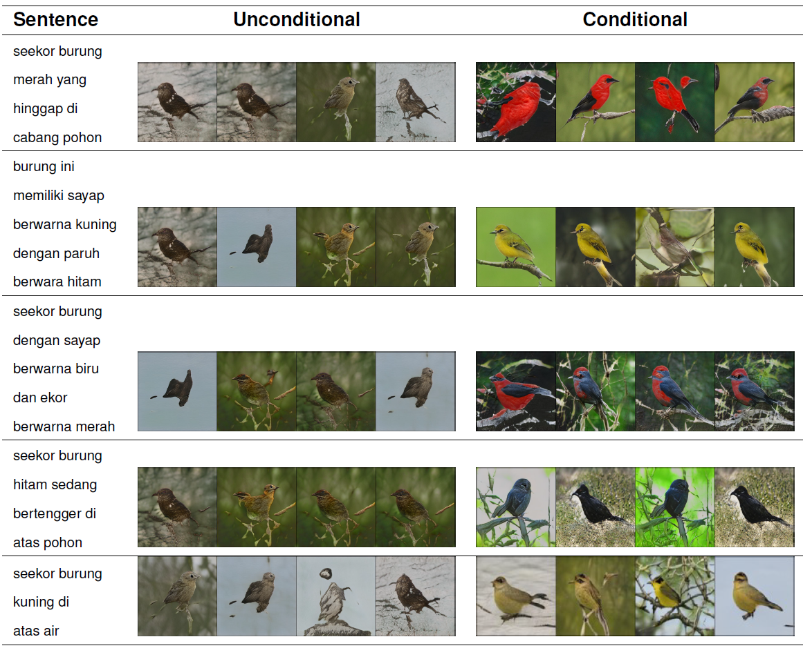

# Indonesian Text-to-Image Synthesis with Sentence-BERT and FastGAN
This code is implementation of [Indonesian Text-to-Image Synthesis with Sentence-BERT and FastGAN](#) paper.

# Installation
1. you can install the dependency using the `requirements.txt` file
2. Download [birds](http://www.vision.caltech.edu/visipedia/CUB-200-2011.html) image data and store it on `dataset/birds`

# Train Sentece-BERT
you can fine-tune the SBERT by the following commands

```bash
python finetune_sbert.py --cfg config/cub_200_2011.yaml
```

you will get the pretrained text encoder on `checkpoints` directory or you can download our pretrained [models](https://drive.google.com/file/d/1CbfnFOQUpc8wr_mDUrC3JTKW-4xdYYKA/view?usp=sharing)

# Preprocess Dataset
Next, you need to preprocess the datasets, so the FastGAN can train it. Run the following commands

```bash
python create_dataset.py --cfg config/cub_200_2011.yaml
```

you can download our preprocessed dataset ([test](https://drive.google.com/file/d/1IPvjhw1cVlIAO9zympVJ1RIWVPHe0Z8D/view?usp=sharing), [train](https://drive.google.com/file/d/1RnjAA295bsVjtpIxyKQz4LXrXdZpIt9W/view?usp=sharing))

# Train FastGAN
train using the following command
```bash
python train_fastgan.py --cfg config/cub_200_2011.yaml
```

you can download our pretrained model [here](https://drive.google.com/file/d/1erfp5LcT4AkCaH7A-W37l6NDOUO4F-NV/view?usp=sharing)

# Example Results


# References
The FastGAN implementation is adopted from [odegeasslbc](https://github.com/odegeasslbc/FastGAN-pytorch)


